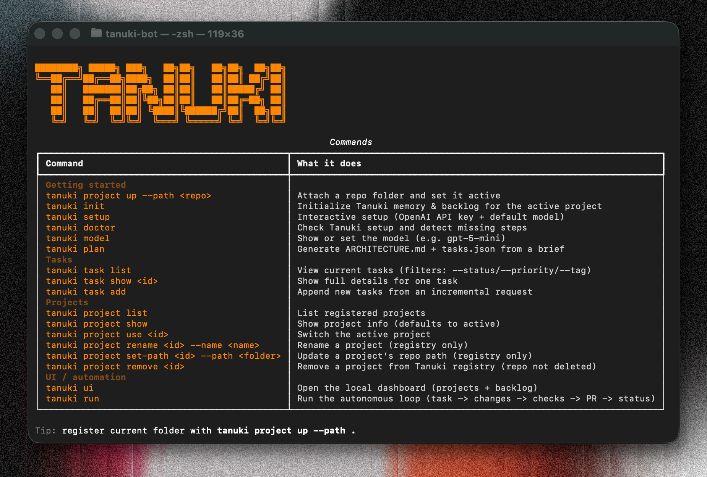

# TanukiBot

An AI agent that generates full project structures via self-feedback, without writing code.

## 

## Overview

TanukiBot is a Python-based AI agent designed to autonomously generate and evolve complete project structures.  
Instead of producing raw code line by line, it operates at a higher abstraction level: planning, structuring, validating, and iterating through internal feedback loops.

It is built as a CLI-driven system with task tracking and execution, suitable for bootstrapping repositories and early-stage project architecture.

---

## Project Structure

```text
.
├── img/                # Assets (banner, visuals)
├── src/                # Core TanukiBot source code
├── tests/              # Test suite
├── .git/               # Git metadata
├── .venv/              # Local virtual environment
├── .python-version     # Python version pin
├── pyproject.toml      # Project configuration and dependencies
├── README.md           # Documentation
├── uv.lock             # Dependency lockfile
```
